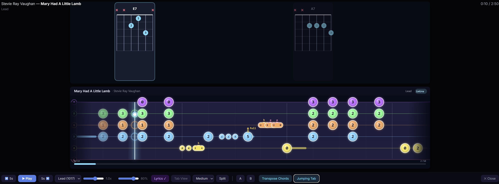

# Forked Version Adjustments

- changed the order of the String names as from my examples I think they were upside down

- added chord boxes to move on top of the note highway as I have trouble identifying the chord shapes only based on the tab like notation

- changed the string colors to match the rocksmith colors for me to not get confused and also limited the highlight effect when the notes hit the hitline as it was a bit much for me



# Jumping Tab

A [slopsmith](https://github.com/byrongamatos/slopsmith) plugin that adds a Yousician-style 2D horizontal tab view to the player. Notes flow right-to-left toward a glowing hit line, trajectory arcs connect consecutive monophonic notes, and a glowing ball visibly hops along those arcs.


## Features

- **2D horizontal tab** — notes scroll right→left on color-coded string lines, player view (low E on top).
- **Trajectory arcs** — dashed cyan curves connect every consecutive note group (chords included) so you can see the melodic contour.
- **Hopping ball** — a glowing ball traces the melody and squashes when it crosses the hit line.
- **Technique rendering** — hammer-ons, pull-offs, and slides are drawn as fused capsules with labeled arcs above them; bends get amber arrows with conventional labels (`½`, `full`, `1½`, `2`).
- **Section bands** — the current song section (intro / verse / chorus / solo / outro) is highlighted behind the notes and shown in a badge in the header.
- **Beat & measure ticks** under the notes so you can feel the rhythm grid.
- **Density-aware sizing** — notes shrink automatically in fast passages so adjacent fret circles never overlap, with a visual gutter between them.
- **Progress bar** along the bottom with `mm:ss` timestamps.
- **Auto-detected guitar vs. bass** — 6-string with the full palette, or 4-string layout with a bass-specific subset.
- **Respects arrangement switching** — swapping Lead / Rhythm / Bass in the slopsmith player dropdown rebuilds the tab data live.

### Techniques showcase


The capsule shape on the left is a hammer-on pair (`5`→`7`), the pill after it is a pull-off. Amber arrows with labels show the bend size on each bent note. The chord on the right is rendered as a vertical stack of fret circles, and the preceding trajectory arc lands at the chord's centroid.

### Fast passages


At 120 BPM sixteenth notes, the per-note radius clamps to half the same-string neighbor gap so every circle stays distinct instead of blurring into one blob.

## Install

Clone into your slopsmith `plugins/` directory and restart the web service:

```bash
cd /path/to/slopsmith/plugins
git clone https://github.com/renanboni/slopsmith-plugin-jumpingtab.git jumpingtab
cd ..
docker compose restart web
```

Hard-reload the browser. A **Jumping Tab** button will appear in the player controls when a song is loaded.

## Use

1. Pick a song from your library.
2. Wait for the button to become enabled (song data loading).
3. Click **Jumping Tab** — the 3D highway is replaced with the 2D tab view.
4. Press play. Watch the ball hop.
5. Click the button again to return to the standard highway.

## What it doesn't do (yet)

- No chord name labels.
- No chord-shape diagrams.
- No microphone input or scoring.
- No settings panel for speed / colors / visibility window.
- No standalone full-screen mode — it's a player overlay.

## Tests

`test/test.html` is a zero-dependency browser test harness for the pure helpers (layout math, binary search, trajectory builder, bezier). Open the file directly:

```
file:///path/to/jumpingtab/test/test.html
```

The page title shows `N pass / 0 fail`. Rendering, animation, and plugin integration are verified manually.

## Demo harness

`demo/index.html` is a standalone page that loads `screen.js` with synthetic data and renders a static frame — no slopsmith instance required. It was used to generate the screenshots in this README. Switch scenes with a query string:

```
file:///path/to/jumpingtab/demo/index.html?scene=overview
file:///path/to/jumpingtab/demo/index.html?scene=techniques
file:///path/to/jumpingtab/demo/index.html?scene=fast
```

To regenerate the screenshots yourself:

```bash
CHROME="/Applications/Google Chrome.app/Contents/MacOS/Google Chrome"
for scene in overview techniques fast; do
  "$CHROME" --headless=new --disable-gpu --hide-scrollbars \
    --window-size=1344,484 \
    --screenshot="screenshots/${scene}.png" \
    "file://$(pwd)/demo/index.html?scene=${scene}"
done
```
